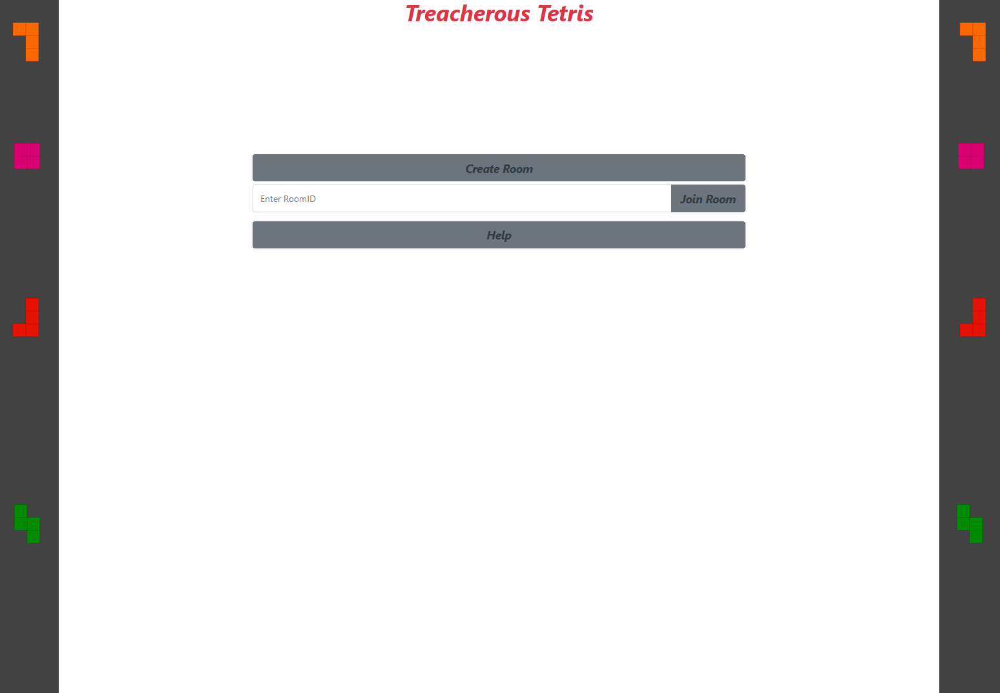
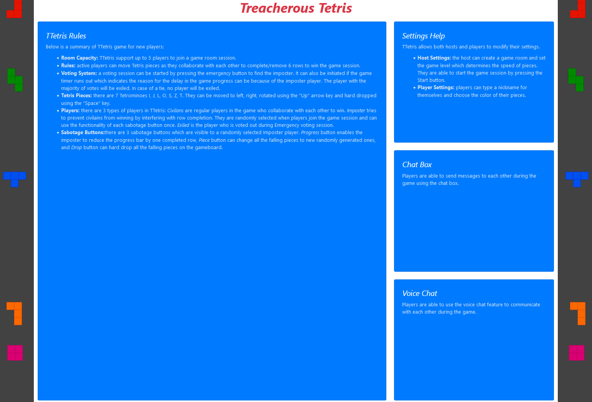
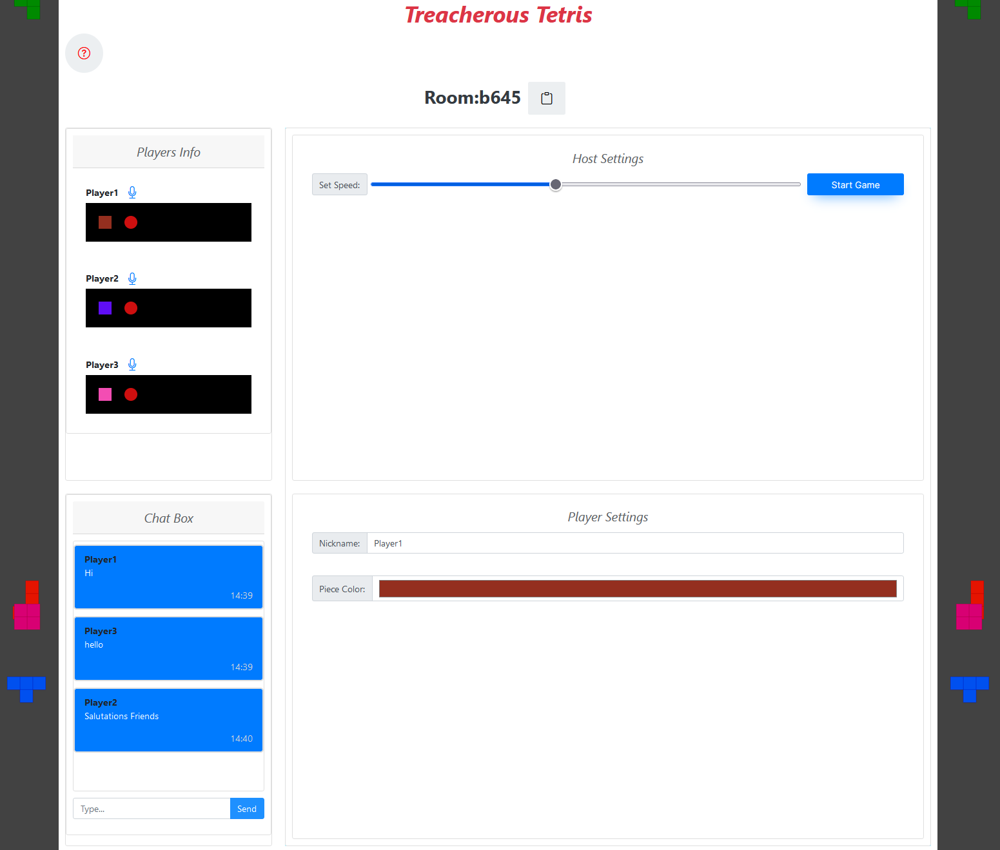
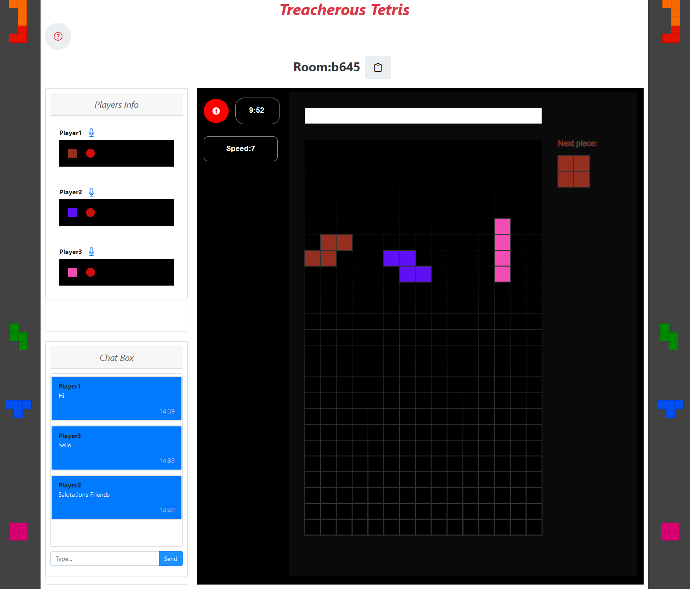

# TTetris
Treacherous Tetris: A capstone project
ECE 493 Winter 2022 - Group 7
## Project members:
- Azeez Abass CCID: aabass
- Wonbin Jeong CCID: wonbin
- Gina Hassanzadeh CCID: ghassanz

## Docs:
- SRS Document
- Preliminary Plan
- Preliminary Design

## Code:
- server
    - src
        - game: game related logic and classes
        - room: room session related logic and classes
        - index.js: initialize server
        - server.js: server and websocket logic
        - util.js: utility functions
- client
    - src
        - pages: contains all views of the application
            - helppage: contains helppage views and components 
            - homepage: contains homepage views and components
            - roompage: contains roompage views and components
        - util: utility functions
        - app.jsx
        - index.jsx

## Running Instructions
- Starting the server:
    - cd code/server
    - yarn install --frozen-lockfile
    - yarn start
- Starting the Client:
    - cd code/client
    - yarn install --frozen-lockfile
    - yarn start

## Screenshots

#### Demo
./screenshots/Demo.mp4

#### Home page

#### Info page

#### Room page

#### Game page

